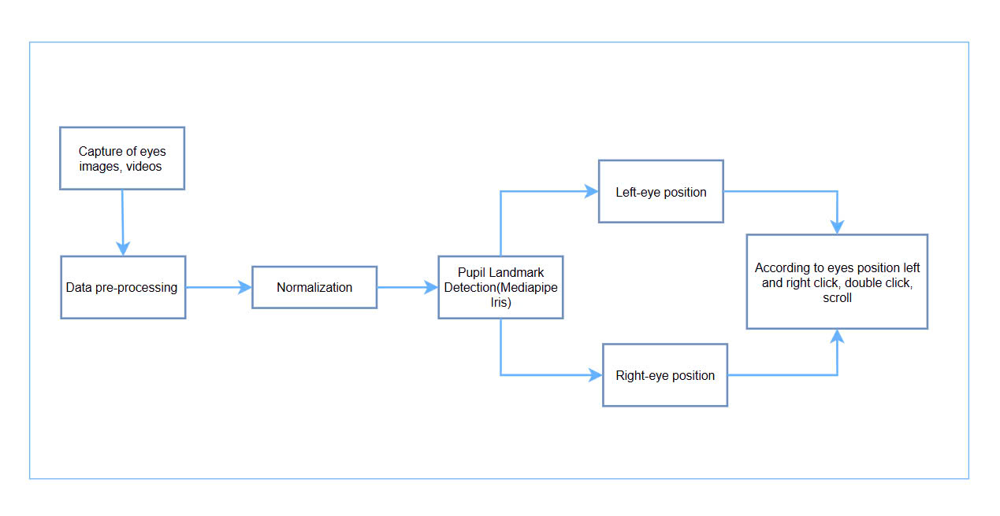
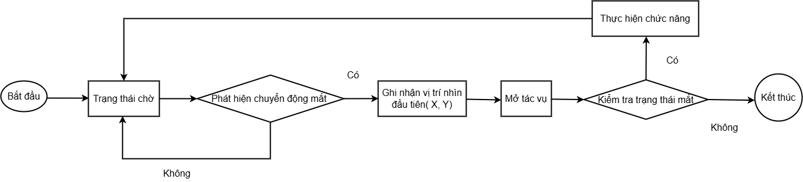
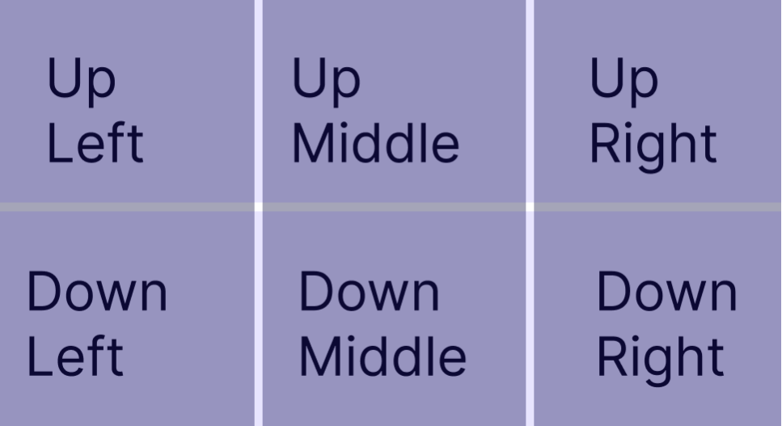

# Hệ Thống Điều Khiển Máy Tính Bằng Chuyển Động Mắt

Xin chào, cảm ơn bạn đã quan tâm đến dự án của tôi. Đây là một hệ thống tương tác với máy tính thông qua chuyển động mắt, dựa trên mô hình Mediapipe và PyAutoGUI. Do hạn chế về cấu hình thiết bị và theo dõi mắt, hệ thống không hoạt động hoàn hảo như dự định; nó yêu cầu bạn di chuyển mắt đến khu vực mà bạn muốn thao tác. Tôi rất mong được sự thông cảm của bạn! :)

## Yêu Cầu Hệ Thống

### Phần cứng:
- Hệ điều hành Windows/macOS/Linux
- Webcam tích hợp hoặc camera ngoài (độ phân giải tối thiểu 720p)

### Phần mềm:
- Python 3.9 trở lên
- Các thư viện: mediapipe, opencv-python, pyautogui, numpy, pillow, tkinter



## Hướng Dẫn Cài Đặt

1. **Cài đặt Python 3.9+** từ [python.org](https://python.org)

2. **Cài đặt các thư viện cần thiết:**
```bash
pip install mediapipe opencv-python pyautogui numpy pillow
```

3. **Tải dự án về máy** và giải nén

## Hướng Dẫn Sử Dụng

### 1) Chạy file login.py
```bash
python login.py
```
- Nhập thông tin người dùng:
- Điền tên hoặc thông tin cá nhân để bắt đầu sử dụng hệ thống

### 2) Bắt đầu theo dõi (vui lòng đợi một chút)
Camera sẽ tự động bật để theo dõi mắt của bạn. Màn hình sẽ hiển thị vị trí con trỏ, hướng nhìn và trạng thái mắt (nháy hoặc mở).

### 3) Các thao tác cơ bản:


- **Nháy mắt trái** để click chuột trái (nháy 2 lần trong 0.4s để double-click)
- **Nháy mắt phải** để click chuột phải (double-click tương tự như mắt trái)
- **Nhìn lên/xuống (phía bên trái)** để cuộn trang
  
- **Nhắm cả 2 mắt trong 5 giây** để tự động thoát
- **Nhấn phím Esc** trên bàn phím hoặc đóng cửa sổ ứng dụng

## Các File Chính

- `login.py` - Giao diện đăng nhập
- `main.py` - Giao diện chính và xử lý camera
- `preprocess.py` - Xử lý theo dõi mắt và điều khiển chuột
- `tracking.py` - Phiên bản đơn giản của theo dõi mắt
- `getlandmark.py` - Hiển thị các điểm mốc trên mắt
- `accuracy.py` - Đo độ chính xác của hệ thống

## Lưu Ý

- Đảm bảo có đủ ánh sáng khi sử dụng
- Ngồi cách camera khoảng 50-70cm
- Tránh di chuyển đầu quá nhiều khi sử dụng
- Hệ thống có thể cần hiệu chỉnh tùy theo từng người dùng
